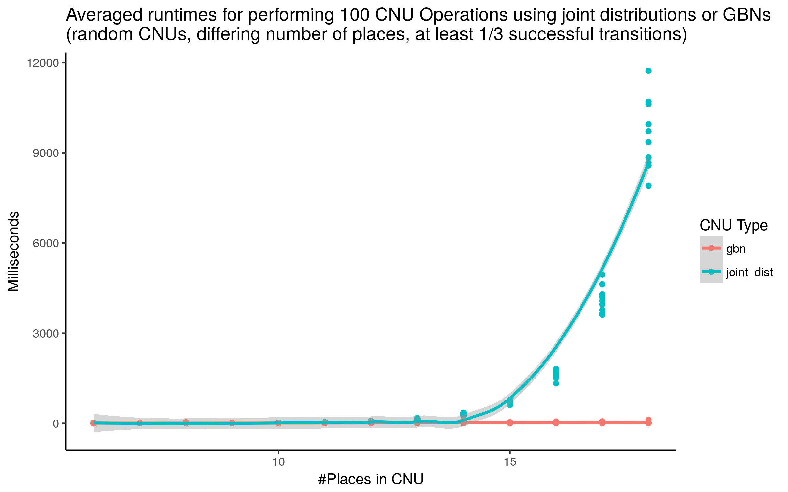

# Updating Probabilistic Knowledge on Condition/Event Nets using Bayesian Networks

This repository contains the implementation and experimental results for the article *"Updating Probabilistic Knowledge on Condition/Event Nets using Bayesian Networks"* submitted to *Concur '18*. 

## Abstract 
The paper extends Bayesian networks (BNs) by a mechanism for dynamic changes to the probability distributions represented by BNs. One application scenario is the process of knowledge acquisition of an observer interacting with a system. In particular, the paper considers condition/event nets where the observer’s knowledge about the current marking is a probability distribution over markings. The observer can interact with the net to deduce information about the marking by requesting certain transitions to fire and observing their success or failure. Aiming for an efficient implementation of dynamic changes to probability distributions of BNs, we consider a slightly more general class of networks that form the arrows of a free PROP with a commutative comonoid structure, also known as term graphs. The algebraic structure of such PROPs supplies us with a compositional semantics that functorially maps BNs to their underlying probability distribution and, in particular, it provides a convenient means to describe structural updates of networks.

## Program
The programs in this repository implement CNUs and GBNs as described in the paper. In order to show the advantage of modelling CNUs with GBNs we implemented the simplification steps for GBNs able turn every GBN into an OBN again, reducing the complexity of evaluating it. In order to have a reference for comparing runtimes we also implemented a variant of CNUs using a simple joint distribution as the underlying model to store probabilities.
Mostly for development purposes there are also functions to load, save, draw and randomly generate GBNs.

GBNs are visualized using GraphViz.
Vertices visualized as small dots and labelled with `i_...` or `o_...` symbolize inputs and outputs of the GBN. Edges are labeled with tuples representing the ports of source and target vertex the edge is connected to.

### CNU Operations modelled by a GBN
The following GIF shows the transformation of the GBN during the running CNU example of the paper. We start with the initial GBN and add vertices according to the successful firing of transition t4 (t3 in the program, since numbering starts at 0) and the failure of firing t1 (t0 in the program). Finally we once call the simplification command to reduce the complexity of the GBN by applying the local and global simplifications described in the paper.

  

### Simplification of GBNs
The next GIF is meant to give an impression of how the simplification of an arbitrary GBN works. To this end we start with a randomly generated GBN with 8 input, 8 outputs and 15 inside vertices to start with. 
Simplifications are then performend by trying (in this order) to apply simplifications called
1. (CoUnit), 
2. (F1) - (F5), 
3. (split_vertex_if_multiple_outputs), 
4. (simplify_matrix_for_duplicate_inputs), 
5. (eliminate_stochastic_vertex_without_outputs), 
6. (switch_substoch_to_front), 
7. (normalize_substoch_front_vertices_without_inputs).

Whenever one of these simplification steps was successfully applied we restart from the beginning. The simplification is complete if none of the above simplification steps can be applied anymore.

### Runtime Results

  

   

## Installation
